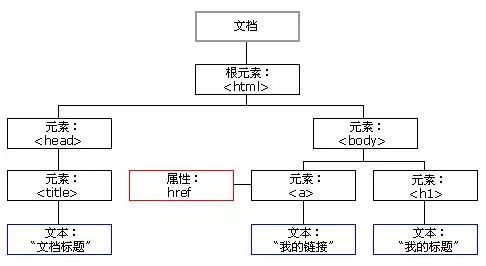

# 前端第四次讲课

## ***Function***

函数是一个可以被其他代码或其自身调用的代码片段，或者是一个指该函数的变量。

```js
// 函数声明
function foo() {
    
}

// 函数表达式
var foo = function () {
    
}

//立即执行函数
(function () {
    
})()
```


###***函数参数***

函数的声明的时候接受的参数叫做形式参数。形式参数是在函数内部的， 当调用函数的时候， 会把实际参数的值赋给函数内部的形式参数。

```js
function sayHi(name) {
    name = name || 'Tom'
    console.log(`Hi, ${name}`)
}

sayHi('Jerry') //Hi, Jerry
sayHi() //Hi, Tom
```

参数传递：

函数内部参数的传递包含 **值传递** 和 **引用传递** 。

值传递是完全独立的拷贝，互不干涉。

对象是通过引用传递，变量赋值只会将地址传递过去。

如果我们将一个已经赋值的变量重新赋值，那么它将包含新的数据或则引用地址。

```js
function change(person) {
    var newPerson = person
    newPerson.name = 'Jerry'
    return newPerson
}

var person1 = {
    name: 'Tom',
    age: 19,
    
}

var person2 = change(person1)

console.log(person1)
console.log(person2)

//浅拷贝
function change(person) {
    var newPerson = {}
    for (var key in person) {
        newPerson[key] = person[key]
    }
    newPerson.name = 'Jerry'
    return newPerson
}

var person1 = {
    name: 'Tom',
    age: 19,
    
}

var person2 = change(person1)

console.log(person1)
console.log(person2)

//深拷贝
function deepCopy(obj) {
      var result = Array.isArray(obj) ? [] : {};
      for (var key in obj) {
        if (obj.hasOwnProperty(key)) {
          if (typeof obj[key] === 'object') {
            result[key] = deepCopy(obj[key]);   //递归复制
          } else {
            result[key] = obj[key];
          }
        }
      }
      return result;
    }
```


arguments 类数组对象

```js
function add() {
    var argsArr = []
    for (var i = 0; i < arguments.length; i++) {
        argsArr.push(arguments[i])
    }
    return argsArr.reduce(function (a, b) {
        return a + b
    })
}

var result = add(1, 2, 3, 4)
console.log(result) // 10
```


### ***return***

return 语句会终止函数的执行并返回函数的值。函数内处理的结果可以使用return 返回，这样在调用函数的地方就可以用变量接收返回结果。return 关键字内任何类型的变量数据或表达式都可以进行返回，也可以不返回用来终止函数执行

```js
function square(x) {
    if (typeof(x) !== 'number') {
    	console.log('Not a number!')
        return
    }
    return x * x
}
var a = square(2)
console.log(a) // 4
console.log(square('abc')) // Not a number!
```


###***作用域***

广义的作用域是一套 **规则** ，这套规则用来管理 JS 引擎如何在当前作用域及其上层的父作用域中根据标识符名称进行 **变量查找** 。

狭义的作用域包括：

- 全局作用域
- 函数作用域
- 块级作用域 ( let、const )

作用域的使用提高了程序逻辑的局部性，增强程序的可靠性，减少名字冲突。

词法作用域与动态作用域：

作用域共有两种工作模型，词法作用域与动态作用域，JavaScript 中采用的是词法作用域模型。词法作用域是由 **写代码时将变量和块作用域写在哪里** 来决定的。

```js
//全局作用域
var value = 1

function foo() {
    //foo函数的作用域
    console.log(value)
}

function bar() {
    //bar函数的作用域
    var value = 2
    foo()
}

bar()


var value = 1
function bar() {
    var value = 2
    function foo() {
        console.log(value)
    }
    foo()
}
bar()
```


### ***变量提升与函数提升***

简单的来讲，在执行 JavaScript 代码的时候会经过两个阶段，第一个阶段为编译阶段，这个时候包括变量和函数在内的所有 **声明** 会被首先处理，将变量声明及函数声明提升至当前作用域的顶端。第二个阶段即为执行阶段，像 **赋值、运算、函数执行** 这些操作就是在这个阶段进行的。因此，我们才有了变量提升和函数提升这一概念。

```js
// 变量提升
console.log(a)
var a = 2

var a
console.log(a)
a = 2

// 函数提升
foo(2, 8)

function foo(x, y) {
    return x + y
}

// 函数表达式
foo(2, 8)

var foo = function (x, y) {
    return x + y
}

// 函数内部的变量提升
var a = 2

function foo() {
    console.log(a)
    var a = 4
}

foo()
```


###***回调函数***

函数A作为参数(函数引用)传递到另一个函数B中，并且这个函数B执行函数A。我们就说函数A叫做回调函数。

```js
function foo(num, callback) {
    num = num + 1
    callback(num)
}

function print(a) {
    console.log(a)
}


foo(1, print) // 2
```

回调函数使用场景：

- 事件监听器/处理器
- 异步调用
- setTimeout和setInterval方法
- 精简代码


### ***闭包***

什么是闭包？

当函数可以记住并访问所在的词法作用域时，就产生了闭包，即使函数是在当前词法作用域之外执行。

```js
function foo(){
    var a = 1
    function bar() {
        a++
        console.log(a)
    }
    return bar
}

var fn = foo()
fn() // 2
fn() // 3


function handleLives() {
	var lives = 3
	return {
		getLives: function () {
			return lives
		},
		die: function () {
			lives--
		}
	}
}

var npc1 = handleLives()
var npc2 = handleLives()
npc1.die()
console.log(npc1.getLives())
console.log(npc2.getLives())
```

闭包的作用

- 让被引用的变量值始终保持在内存中
- 间接访问函数内部的变量（隐藏变量）


## ***DOM*** (Document Object Model)

> DOM 是 JavaScript 操作网页的接口，全称为“文档对象模型”(Document Object Model)。它的作用是将网页转为一个 JavaScript 对象，从而可以用脚本进行各种操作(比如增删内容)。

```html
<html>
	<head>
		<title>文档标题</title>
	</head>
	<body>
		<a href=“https://baidu.com”>我的链接</a>
		<h1>我的标题</h1>
	</body>
</html>
```



文档对象模型就是基于这样的文档视图结构的一种模型所有的html页面都逃不开这个模型，也可以把它称为节点树更为准确。

### ***节点类型***

| 名字             | 作用                               |
| :--------------- | ---------------------------------- |
| Document         | 整个文档树的顶层节点，但不是根节点 |
| DocumentType     | doctype标签                        |
| Element          | 网页的其他各种标签                 |
| Attribute        | 标签的属性                         |
| Text             | 标签与标签之间的文本               |
| Comment          | 注释                               |
| DocumentFragment | 文档的片段                         |

这些节点有许多不同的类型，我们只用关心下面三种：

**元素节点（Element）、文本节点（Text）和属性节点（Attribute）。**


### ***节点操作***

#### ***获取节点***

获取元素节点有4种方法，分别通过**元素ID，标签名字，类名**和**css选择器**来获取。

##### 元素ID

`getElementById`方法是document对象特有的函数，传入一个参数即元素的id属性值，将返回一个对象。

```html
<div id="title">Hi<div>
document.getElementById('title')
```


##### 标签名字

`getElementsByTagName`方法会返回一个类数组对象，数组的元素就是和getElementById差不多的获取到的对象

```html
<ul>
    <li>1</li>
    <li>2</li>
    <li>3</li>
</ul>
document.getElementsByTagName('li')
```


##### 类名

`getElementsByClassName`方法让我们能够通过class类名来访问元素。它的返回值和getElementsByTagName类似，都是返回一个类数组对象

```html
<p class="red">Hi</p>
<div class="red">Hi</div>
document.getElementsByClassName('li')
```


##### css选择器

html5中新增的两个方法，参数则都为CSS选择器字符串

`querySelector`方法返回单个节点，如果有多个匹配元素就只返回第一个，如果找不到匹配就返回null。

`querySelectorAll`方法返回一个类数组对象

```html
<div id="title">Hi<div>
document.querySelector('#title')

<ul>
    <li>1</li>
    <li>2</li>
    <li>3</li>
</ul>
document.querySelector('li')

<p class="red">Hi</p>
<div class="red">Hi</div>
document.querySelector('.red')
```


#### ***DOM修改***

##### 创建HTML内容

改变元素内容的最简单的方法是使用 innerHTML /innerText属性。

```js
<html>
<body>
    <p id="p1">Hello World!</p>
    <p id="p2">Hello World!</p>
    <script>
        document.getElementById("p1").innerHTML = "<div style='color: red'>New text!</div>"
        document.getElementById("p2").innerText = "<div style='color: red'>New text!</div>"
    </script>
</body>
</html>
```


##### 创建插入新的元素

```js
<html>
<body>
    <div id="parent">
        <p>This is a paragraph.</p>
        <p>This is another paragraph.</p>
    </div>
    <script>
        var pEle = document.createElement("p")//createElement()方法能创建元素节点
        var textNode = document.createTextNode("This is new.")//createElement()方法能创建文本节点
        pEle.appendChild(textNode)
        var element = document.getElementById("parent")
        element.appendChild(pEle) //appendChild()方法可向节点的子节点列表的末尾添加新的子节点。

		/**
		*insertAdjacentHTML()方法
		*接收两个参数:插入位置和要插入的HTML文本。第一个参数必须是下列值之一
		*“beforebegin”：在当前元素之前插入一个紧邻的同辈元素
		*“afterbegin”：在当前元素之下插入一个新的子元素或者在第一个子元素之前再插入新的子元素
		*“beforeend”：在当前元素之下插入一个新的子元素或者在最后一个子元素之前再插入新的子元素
		*“afterend”：在当前元素之后插入一个紧邻的同辈元素。
		*/
		var element = document.getElementById("parent")
		element.insertAdjacentHTML("beforeend","<p>This is new.</p>")
    </script>
</body>
</html>
```


##### 改变元素的样式

通过DOM能够访问HTML元素的Style对象。

```js
<html>
<body>
    <div class="content">Hello world!</div>
    <script>
        var content = document.querySelector(".content")
        content.style.cssText = "color: red; font-weight: 600;"
        content.style.background = "blue"
        content.style.width = "200px"
        content.style.fontSize = "30px"
    </script>
</body>
</html>
```

classList 属性

classList 属性返回元素的所有类名的类数组对象

| 方法                          | 描述                                 |
| ----------------------------- | ------------------------------------ |
| add(*class1, class2, ...*)    | 在元素中添加一个或多个类名。         |
| remove(*class1, class2, ...*) | 移除元素中一个或多个类名。           |
| contains(*class*)             | 返回布尔值，判断指定的类名是否存在。 |
| toggle(*class,* true\|false)  | 在元素中切换类名。                   |
| item(*index*)                 | 返回类名在元素中的索引值。           |

```js
<html>
<style>
    .content-active {
        background: pink;
        width: 100px;
        height: 100px;
    }
</style>
<body>
    <div class="content">Hello world!</div>
    <script>
        var content = document.querySelector(".content")
        content.classList.add('content-active')
    </script>
</body>
</html>
```


##### 改变元素的属性

```js
<html>
<body>
    <a href="#" id="jump">我不跳转</a>
    <script>
        var jump = document.querySelector('#jump')
        console.log(jump.getAttribute("href"))//getAttribute(attr)方法返回属性的值
        jump.setAttribute("href", "http://baidu.com")//setAttribute(attr, value)方法设置属性的值
        jump.target = "_blank"//可直接用属性赋值
    </script>
</body>
</html>
```


### *事件*

事件是可以被 JavaScript 侦测到的行为。 网页中的每个元素都可以产生某些可以触发 JavaScript 函数或程序的事件。用户交互都是通过**事件监听**来呈现出我们想要的效果。

| 常见的事件 |                                                              |
| ---------- | ------------------------------------------------------------ |
| click      | 点击事件                                                     |
| mouseover  | 鼠标指针位于一个元素外部，然后用户将首次移动到另一个元素边界之内时触发 |
| mouseleave | 元素上方的**光标移动到元素范围之外**时触发。                 |
| focus      | 在元素获得焦点时触发。                                       |
| blur       | 在元素失去焦点时触发。                                       |


#### *事件监听*

#####**DOM 0级事件模型**

- HTML中直接绑定（不推荐）

```js
<button id="button" onclick="handleClick()">ClickMe</button>

<script>
    function handleClick() {
        var button = document.getElementById("button")
        button.innerHTML = "hello!"
    }
</script>
```

- JS指定属性值

  ```js
  var button = document.getElementById("button")
  button.onclick = function() {
      //...
  }
  ```


##### DOM 2级事件模型

```js
//DOM 2级事件，第一个参数为事件名，第二个参数是一个回调函数，第三个参数是一个布尔值（默认为false），true表示捕获阶段调用事件处理程序，false表示冒泡阶段调用事件处理程序。
var button = document.getElementById("button")
button.addEventListener('click', function() {
    //...
}, false)
```


##### DOM 0级和DOM 2级事件模型比较

- 移除监听函数

  ```js
  button.onclick = null
  
  button.removeEventListener('click', click)
  //注意，addEventListener()添加的匿名函数无法移除
  
  button.removeEventListener('click', function () {
  	
  }) //这样移除监听函数的方法是错误的！！
  ```

- 同时绑定多个监听器

  ```js
  <html>
  <body>
      <button id="button">ClickMe</button>
      <script>
          var button = document.querySelector('#button')
          button.onclick = function () {
              console.log(1)
          }
          button.onclick = function () {
              console.log(2)
          }
          button.addEventListener('click', function () {
              console.log(3)
          }, false)
          button.addEventListener('click', function () {
              console.log(4)
          }, false)
      </script>
  </body>
  </html>
  // 2
     3
     4
  ```

  可见DOM0 级后绑定的函数会把前边的替换掉，而DOM 2级可以同时绑定多个监听器，因此推荐使用addEventListener方法监听事件。


#### ***事件流***

事件流描述的是在页面中接受的事件顺序。看下面的例子

```js
<html>
<body>
    <!-- HTML -->
    <div id="container">
        Container
        <button id="button">ClickMe</button>
    </div>
    <!-- JS -->
    <script>
        var container = document.getElementById("container")
        var button = document.getElementById("button")
        button.onclick = function() {console.log('button!')}
        container.onclick = function() {console.log('container!')}
    </script>
</body>
</html>
```

当你点击button按钮时，会发生在button按钮上的单击事件，但同时，你也单击了container元素甚至是单击了整个页面。因此，如果你单击的多个元素都绑定了相同事件，他们执行的事件顺序是怎么样的呢？

事件流有两种：

事件冒泡：事件开始时由最具体的元素（文档中嵌套层次最深的那个节点）接受，然后逐渐向上传播到较不具体的那个节点。

```
<button> -> <#container> -> <body> -> <html> -> document
```

事件捕获：与事件冒泡相反。事件最开始由不太具体的节点最早接受事件, 而最具体的节点最后接受事件。

```
document -> <html> -> <body> -> <#container> -> <button>
```

在这个例子中，事件是通过DOM 0级事件（默认发生在冒泡阶段）添加的，所以先打印“button!”后打印“container!”。

要让事件发生在捕获阶段也很简单

```js
//DOM 2级事件第三个参数是一个布尔值（默认为false），true表示捕获阶段调用事件处理程序，false表示冒泡阶段调用事件处理程序。
button.addEventListener('click', function(){
    console.log('button!')
}, true)
container.addEventListener('click', function(){
    console.log('container!')
}, true)
```


####***事件对象***

触发DOM上的事件后，会产生一个事件对象event，作为参数传给监听函数。

- 事件对象常用属性

- - target 事件的目标
  - type 被触发的事件的类型

- 事件对象常用方法

- - preventDefault() 取消事件的默认行为
  - stopPropagation() 阻止事件继续传播（冒泡和捕获），不包括在当前节点上其他的事件监听函数。
  - stopImmediatePropagation() 阻止所有事件继续传播，包括在当前节点上其他的事件监听函数。

- return false 相当于同时执行了 event.preventDefault 与 event.stopPropagation

了解更多事件对象的属性和方法 [事件对象](https://developer.mozilla.org/zh-CN/docs/Web/API/Event)


尝试一下实现页面内点击弹窗外部关闭弹窗，点击弹窗内部不会关闭弹窗。

```js
<html>
<body>
    <div id="pop-up-window"></div>
</body>
<script>
    var body = document.querySelector('body')
    var popUpWindow = document.getElementById('pop-up-window')
    body.addEventListener('click', function (e) {
        popUpWindow.style.display = 'none'
    }, false)
    popUpWindow.addEventListener('click', function (e) {
        e.stopPropagation() //在弹窗内部点击时阻止事件传播，因此不会触发body的click事件
    }, false)
</script>
</html>
```

#### ***事件委托***

借助事件冒泡和事件对象，可以实现事件委托（又叫事件代理）。

先思考如何给下面的按钮都绑定一个click事件，点击后输出按钮的内容

```html
    <div id="container">
        <button id="button1">1</button>
        <button id="button2">2</button>
        <button id="button3">3</button>
        <!-- ... -->
        <button id="button10">10</button>
    </div>
```

或许你会想这么写

```js
for (var i = 1; i <= 10; i++) {
            document.getElementById("button" + i).addEventListener('click', function(e) {
                console.log(e.target.innerText)
            }, false)
        }
```

每个函数都是对象，都会占用内存，现在创建了10个监听事件，影响了页面性能。我们利用事件委托（又叫事件代理）可以解决这个问题。事件委托借助事件冒泡和事件对象，只需要创建一个监听器，就可以管理一个类型的所有事件。只需要在DOM树尽量最高的层次创建一个监听。

```js
        document.getElementById('container').addEventListener('click', function(e) {
            if (e.target.tagName.toLowerCase() === 'button') {
            	console.log(e.target.innerText)
            }
        }, false)
```


##***BOM (Browser Object Model)***

> BOM，browser object model，浏览器对象模型，这个对象就是对应着浏览器窗口window。
>
> 它提供了一些方法用于访问浏览器的功能，这些功能和网页内容无关。


### ***window对象***

window对象是BOM的核心，表示浏览器正打开的窗口，它是一个**全局对象**。另外**我们定义的全局变量，其实也是定义到了window上的**。

```js
var a = 1
a === window.a // true
```

| window对象常用方法     |                                                              |
| ---------------------- | ------------------------------------------------------------ |
| alert()                | 弹出一个警告对话框                                           |
| prompt()               | 弹出一个输入对话框                                           |
| confirm()              | 弹出一个确认对话框。如果单击“确定按钮”返回true，如果单击“取消”返回false。 |
| close()                | 关闭窗口                                                     |
| open()                 | 打开一个新的浏览器窗口                                       |
| **window对象常见事件** |                                                              |
| load                   | 当页面完全加载完之后触发                                     |
| scroll                 | 文档被滚动期间重复被触发                                     |
| resize                 | 改变窗口尺寸时触发窗口变化事件                               |


### ***延时器/定时器***

**setTimeout(callback, milliseconds)** 方法用于在指定的毫秒数后调用函数或计算表达式。

使用 [clearTimeout()](http://www.runoob.com/jsref/met-win-cleartimeout.html) 方法来阻止函数的执行。

```js
setTimeout(function () {
    console.log('Hi!')
}, 3000)

//三秒后输出'Hi!'

var timer = setTimeout(function () {
    console.log('Hi!')
}, 3000)

clearTimeout(timer)
//无输出
```


**setInterval(callback, milliseconds)** 方法可按照指定的周期来调用函数或计算表达式。会不停地调用函数，直到 [clearInterval()](http://www.runoob.com/jsref/met-win-clearinterval.html) 被调用或窗口被关闭。

```js
var timer = setInterval(function () {
    console.log('Hi!')
}, 3000)

//每三秒输出'Hi!'

clearInterval(timer)
//无输出
```


### ***其它常用对象***

| navigator对象    | 这个对象提供几个属性，用于辅助检测浏览器环境                 |
| ---------------- | ------------------------------------------------------------ |
| **location对象** | **这个对象让我们可以访问当前载入的URI（统一资源标识符）的任意信息** |
| **history对象**  | **这个对象提供了通过用户访问产生的浏览历史来向前或向后移动的方法。** |


## 作业

`level1`

1. **动态**创建一个div，设置几个按钮可以控制div上下左右移动和放大缩小
   - 基本要求
     - 有过渡动画(提示：css transition)
2. 做一个返回顶部的按钮
   - 基本要求
     - 页面滚动时div始终能固定在页面上（记得把body高度设高点）
     - 点击按钮返回顶部时有过渡的滚动效果，不要直接瞬间蹦到页面顶部（提示：setInterval）
   - 加分项
     - 浏览器滚动到一定高度时才显示按钮
     - 返回顶部的速度根据点击时距离顶部的高度而不同
     - 兼容大部分浏览器

`level2`

自慰留言板

- 基本要求
  - 输入昵称和留言内容，点击发送后添加留言
  - 页面能显示所有发送的留言
  - 可以对留言点赞/取消赞，点赞后有不同的样式
- 加分项
  - 自己设计个好看的界面
  - 发送留言后添加的留言有进场动画（提示：css3）
  - 利用事件委托监听点赞
  - 可以对评论进行回复
  - 显示留言者的使用的浏览器、操作系统信息（提示：navigator对象、正则表达式）

以上两个作业任意完成一个就好（至少level1所有同学都是能完成的），加分项尽量做，不会就百度，实在不会就私聊我吧，不许直接复制粘贴或一行一行的抄代码，不能使用库和框架。最好能尝试一下把你们的作业部署在Github Pages上，然后把作业的仓库地址和部署的网页地址都发送邮箱到 ***chenwentao@redrock.team***