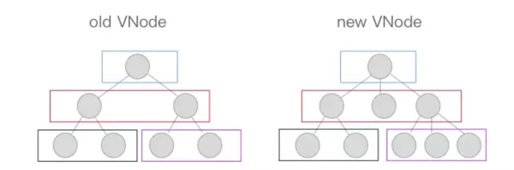

# 框架通识

## 前端框架的好处

- 组件化: 其中以 React 的组件化最为彻底,甚至可以到函数级别的原子组件,高度的组件化可以是我们的工程易于维护、易于组合拓展。
- 天然分层: JQuery 时代的代码大部分情况下是耦合严重,现代框架MVVM 模式都能帮助我们进行分层，代码解耦更易于读写。
- 生态: 现在主流前端框架都自带生态,不管是数据流管理架构还是 UI 库都有成熟的解决方案。

简单来说,前端框架的根本意义是解决了**UI 与状态同步问题**。

## SPA（单页面应用）

单页面应用的全称是 single-page application，简称 SPA，它是一种网站应用的模型，它可以动态重写当前的页面来与用户交互，而不需要重新加载整个页面。单页应用的流畅性让 Web 应用更像桌面端或 Native 应用了。

### 前端路由

SPA 的一个重要实现就是改变路由时，页面不刷新。前端路由实现起来其实很简单，本质就是监听 URL 的变化，然后匹配路由规则，显示相应的页面，并且无须刷新。实现这个功能，通常有两种方式：使用 window.history 对象或 location.hash。

#### hash路由

hash 是 location 对象的属性，它指的是当前 url 的锚，也就是从 # 号开始的部分。修改 location.hash 并通过 hashchange 事件来监听到 URL 的变化，从而进行跳转页面。


#### history路由

window.history 对象包含了浏览器的历史信息，它有以下几种常用方法：

- history.back()：与在浏览器点击后退按钮相同；

- history.forward()：与在浏览器中点击按钮向前相同；

- history.go(n)：接受一个整数作为参数，移动到该整数指定的页面，比如 go(1) 相当于 forward()，go(-1) 相当于 back()，go(0) 相当于刷新当前页面。

HTML5 对 history 对象新增了 pushState() 和 replaceState() 方法，这两个方法可以往历史栈中添加数据，给用户的感觉就是浏览器的 url 改变了，但是页面并没有重新加载。pushState() 是在浏览记录中添加一个新记录，replaceState() 则是修改当前的浏览器记录，这是二者的细微差别，使用时参数的字段和含义都是一样的。

```js
window.history.pushState(state, title, url)
/**
* state 存储 JSON 字符串，可以用在 popstate 事件中
* title 表示新页面的标题，但是现在的所有浏览器都会忽略这个字段，所以可以传 null
* url 是新页面的地址，必须是和当前页面在同一个域
*/
```

当用户点击浏览器上的前进和后退按钮时，或者调用上述 window.history 的 back、forward 和 go 方法，就会触发 popstate 事件。


### 优点

- 无刷新体验，用户在切换页面过程中不会频繁被“打断”，因为界面框架都在本地，对用户的响应非常及时，因此提升了用户体验
- 分离前后端关注点，前端负责界面显示，后端负责数据存储和计算，各司其职，不会把前后端的逻辑混杂在一起
- 减轻服务器压力，服务器只用出数据就可以，不用管展示逻辑和页面合成，吞吐能力会提高几倍
- API 共享，同一套后端程序代码，不用修改就可以用于Web界面、手机、平板等多种客户端
- 完全的前端组件化，前端开发不再以页面为单位，更多地采用组件化的思想，代码结构和组织方式更加规范化，便于修改和调整
- 可为页面切换过程添加转场动画

### 缺点

- 对 SEO 不太优好，尽管可以通过 [Prerender](https://prerender.io/) 预渲染优化等技术解决一部分，但是相对还是不容易索引到它
- 初次加载耗时多，首屏加载慢
- 前进、后退、地址栏、书签等，都需要程序进行管理，页面的复杂度很高，需要一定的技能水平和开发成本高

## MVVM

MVVM 的全称是 Model-View-ViewModel，它是一种架构模式，MVVM 由以下三个内容组成

- View：界面
- Model：数据模型
- ViewModel：作为桥梁负责沟通 View 和 Model

Model 层是数据层，它只关心数据本身，不关心数据如何操作和展示；View 是视图层，负责将数据模型转化为 UI 展现给用户；ViewModel 为视图提供引擎，用来处理业务逻辑。

在 MVVM 中，最核心的也就是数据双向绑定，例如Vue 中的双向绑定。

### Object.defineProperty实现双向绑定

`Object.defineProperty`的作用就是劫持一个对象的属性,通常我们对属性的`getter`和`setter`方法进行劫持,在对象的属性发生变化时进行特定的操作。

### Proxy实现双向绑定

Proxy 可以理解成，在目标对象之前架设一层“拦截”，外界对该对象的访问，都必须先通过这层拦截，因此提供了一种机制，可以对外界的访问进行过滤和改写。Proxy 这个词的原意是代理，用在这里表示由它来“代理”某些操作，可以译为“代理器”。我们可以认为Proxy是`Object.defineProperty`的全方位加强版。

- 可以直接监听对象而非属性
- 可以直接监听数组的变化
- 多达13种拦截方法,不限于apply、ownKeys、deleteProperty、has等等是Object.defineProperty不具备的
- 性能更好

## 组件化

```html
App:
<div>
  <Header />
  <List />
</div>

Header:
<div>
  <Logo />
  <button>菜单</button>
</div>

List:
<ul>
  <li>text 1</li>
  <li>text 2</li>
  <li>text 3</li>
</ul>

Logo:
<div>
  
  <p>text logo</p>
</div>
```


## Virtual Dom（虚拟DOM）

众所周知，操作 DOM 是很耗费性能的一件事情，既然如此，我们可以考虑通过 JS 对象来模拟 DOM 对象，毕竟操作 JS 对象比操作 DOM 省时的多。Virtual Dom 算法的实现简单来说以下三步：

1. 通过 JS 来模拟创建 DOM 对象
2. 判断两个对象的差异
3. 渲染差异

```js
<div>
  Hello World
  <ul>
    <li id="1" class="li-1">
        第1
    </li>
  </ul>
</div>

      {
        tag: "div",
        props: {},
        children: [
          "Hello World",
          {
            tag: "ul",
            props: {},
            children: [
              {
                tag: "li",
                props: {
                  id: 1,
                  class: "li-1"
                },
                children: ["第", 1]
              }
            ]
          }
        ]
      }
```

###diff算法

diff算法是通过同层的树节点进行比较而非对树进行逐层搜索遍历的方式，所以时间复杂度只有O(n)，是一种非常高效的算法。



## 作业

- 使用history/hash路由简单封装一个前端路由，例如

  ```js
  var router = new Router()
  router.set('homepage', function() {
    document.querySelector('.container').innerHTML='helloworld'
  })
  ```

- 使用proxy实现简单的双向数据绑定
- 实现一个简单的MVVM框架（进阶）
- 写个网页，要使用和体现到上边写的东西

这次的作业可以查看网上的资源，看懂了再自己写或仿照着写，能写多少写多少，下周六0点前把作业的github地址发到chenwentao@redrock.team